# Pricing & Costing Analytics

[](https://github.com/KushPatel29/pricing-costing-analytics/actions/workflows/ci.yml)


**Live app:** [cost-to-price-calculator.streamlit.app](https://cost-to-price-calculator.streamlit.app/)
· **[Metric reference](docs/METRICS.md)**
· **[Data dictionary](docs/DATA_DICTIONARY.md)**
· **[Dashboard screenshots](docs/powerbi/screenshots/)**

A pricing analyst's whole job for a multi-category B2B wholesale distributor,
from a vendor invoice to a decision somebody has to defend on Monday.
**Seventeen Streamlit pages**, a **generated nineteen-page Power BI project**,
**six SQL marts** that check the Python, and three complete fiscal years of
market, transaction, cost and ERP data underneath all of it.

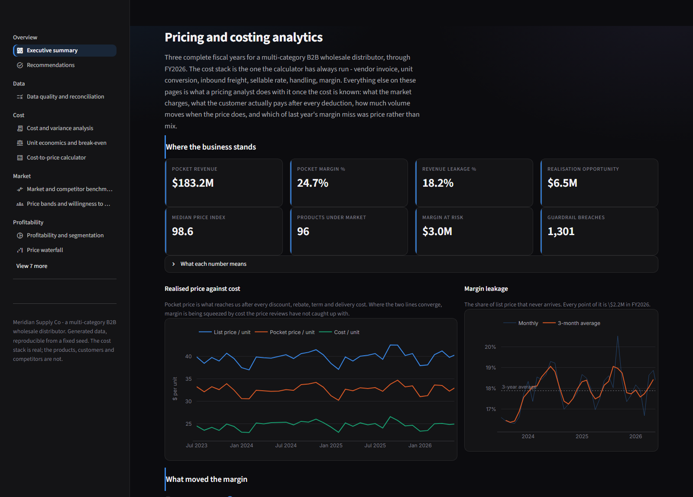

It started as one tool — walk a product from a vendor invoice to a selling price
and push the result back into the ERP's price list. That tool is still here,
unchanged in what it does. Everything around it is the rest of the job: what the
market charges, what the customer actually pays after every deduction, how much
volume moves when the price does, which of last year's margin miss was price
rather than mix, and what to do about any of it.

```bash
pip install -r requirements.txt
streamlit run app/streamlit_app.py
```

It opens on generated data, so there is nothing to prepare.

---

## Contents

| | |
|---|---|
| [The business](#the-business) | Who Meridian Supply Co is, and where the numbers land |
| [The cost stack](#the-cost-stack) | The floor every price is built from |
| [The pricing stack](#the-pricing-stack) | Twelve tested modules, and what each decides |
| [The data](#the-data) | Generated to be *recoverable*, plus an ERP extract with real defects |
| [The SQL layer](#the-sql-layer) | Six marts, computed twice, held to 1e-8 |
| [The app](#the-app) | Seventeen pages, dark, validated palette |
| [The dashboard](#the-dashboard) | Nineteen pages, generated from spec, with layouts you can read |
| [Metrics](#metrics) | Every number, with its definition |
| [Running it](#running-it) | Five commands |
| [What is checked](#what-is-checked) | 2,455 tests, and the defects they were written after |

---

## The business

**Meridian Supply Co** — a wholesale distributor across eight categories:
consumer electronics, home and kitchen, office and stationery, tools and
hardware, health and beauty, sporting goods, pet supplies, apparel. 240 items in
four brand tiers, 150 customers across eight segments from marketplace sellers
to government and education, twelve salespeople, five competitors, six inbound
lanes from ocean LCL to domestic FTL.

Where the numbers land on the generated book (FY2026):

| | | |
|---|---:|---|
| Pocket revenue | **$183.2M** | after every discount, rebate, term and delivery cost |
| Pocket margin | **24.7%** | on pocket, not on list |
| Revenue leakage | **18.2%** | share of list that never arrives — $2.2M a point |
| Realisation opportunity | **$6.5M** | moving every below-median line to its product's own median |
| Margin at risk | **$3.0M** | extended margin on 1,301 guardrail breaches |
| Purchase price variance | **−$0.7M** | actual input cost against the standard frozen that July |
| Average pass-through | **0.61** | share of an input-cost move that reached the realised price |
| Data quality score | **98.52%** | row-weighted over twelve rules and 157,746 row-checks |
| Recommended actions worth | **$2.65M** | of annual gross margin, across 240 products |

---

## The cost stack

The original tool, and still the floor everything else is built on.

```
vendor invoice price
  ÷ units per billing UOM   →  actual invoice cost per unit
  + market adjustment       →  market cost
  + inbound freight by lane →  landed cost
  ÷ sellable rate           →  sellable input cost   ← shrink, damage, returns
  + handling + labelling    →  final cost
  ÷ (1 − margin)            →  base price
```

Two of those steps are where this kind of tool usually goes wrong.

**The sellable rate is a divisor, not a discount.** A pallet of 100 units that
yields 92 saleable ones after damage, shrink and returns has a sellable rate of
0.92. You have to buy `1/0.92` units for every unit you sell, so cost is
*divided* by it. At 60% sellable a $10 input costs $16.67; at 90% it costs
$11.11.

**Margin is a fraction of price, not of cost.** At a 25% margin a $10 cost
prices at `10 / 0.75 = $13.33`, not `10 × 1.25 = $12.50`. Using markup where
margin is meant underprices every item, and it never announces itself — the tool
keeps working, the gross margin just comes in light. There is a page in the app
for exactly this argument, because in practice the disagreement is never about
the arithmetic. It is about which of the two somebody meant by "we work on 30".

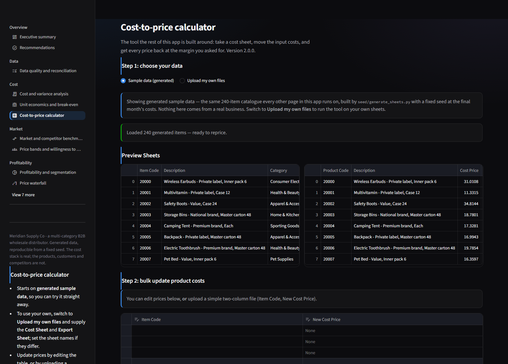

---

## The pricing stack

Cost tells you the floor. It tells you nothing about the price. `pricing/` is
**twelve modules of pure functions** — lists and floats in, dicts out — every one
importable without Streamlit and tested without it.

| Module | Decides |
|---|---|
| `waterfall.py` | List → invoice → net → pocket, and which deduction costs the most |
| `elasticity.py` | How much volume moves when price does, and the optimal price |
| `competitive.py` | Where we sit against the market, and how much of a cost move reached it |
| `variance.py` | Standard-costing variances, and the margin bridge that sums exactly |
| `unit_economics.py` | Contribution, markup vs margin, cost to serve, break-even |
| `scenario.py` | Best/base/worst, tornado, sensitivity grid, break-even inputs |
| `forecast.py` | Six methods, chosen by rolling-origin backtest |
| `bundles.py` | Whether a bundle survives its own cannibalisation |
| `segmentation.py` | Price bands, and willingness to pay from won *and lost* quotes |
| `guardrails.py` | Floor, target, stretch, and who signs for the gap |
| `quality.py` | Twelve rules, and a reconciliation that balances |
| `recommend.py` | One ordered action per product, with the reason |

### The price waterfall

The headline discount is never the whole discount. A customer quoted "8% off
list" also takes a quarterly rebate, an early-payment term, freight we absorb
and a returns allowance, none of which appear on the invoice the salesperson is
looking at.

```
list price
  − on-invoice discounts      → invoice price   (what the invoice says)
  − off-invoice deductions    → net price       (what accounting sees)
  − cost to serve             → pocket price    (what we actually keep)
  − final cost                → pocket margin   (what we actually earn)
```

On the generated book that gap runs to **18.2% of list**. Margin is expressed on
pocket, not on list, because a margin quoted on list is the number that lets a
deal look healthy while losing money: at 18% leakage a 15%-on-list margin is
under 6% on what we keep.

Discounts are additive on list, not compounding — 10% then 5% is 15% off, not
14.5%. Both conventions exist; quoting systems use the additive one because it
is what a salesperson means by "another five points". The convention is stated
once and pinned by a test.

Each bar also carries the amount it *moves* the running total by, which is zero
on a subtotal. Waterfall charts plot steps, so a subtotal bound to its own
absolute value is added on top of the total it summarises and the chart closes
at roughly twice the real figure — drawn, rescaled, and wrong with nothing
raised anywhere.

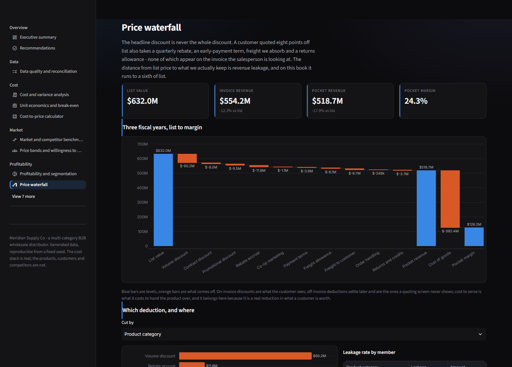

### Elasticity and the optimal price

`ln(q) = a + e·ln(p)`, whose slope *is* the elasticity, because the derivative
of a log is a percentage change. Fitted on list price, with promotional months
excluded, seasonality divided out and a linear trend controlled for. Each of
those four is a correction for a specific confound, and each one moves the
answer.

Three things the module refuses to do:

- **Guess when there is nothing to fit.** Thin samples and flat prices come back
  `usable: False` with the reason in plain words, not as a confident-looking
  slope from four points.
- **Print a price nobody should act on.** The markup rule `p* = c·e/(e+1)` has
  no interior solution above −1, and between −1.0 and −1.25 it returns a
  mathematically correct price at five to fifteen times cost. `exists` and
  `actionable` are separate fields for exactly that reason.
- **Hide the volume hurdle.** Cutting price by `d` on a contribution margin of
  `m` needs volume up by `d/(m−d)` just to stand still. Five points off a 30%
  margin needs +20% volume; off a 15% margin it needs +50%.

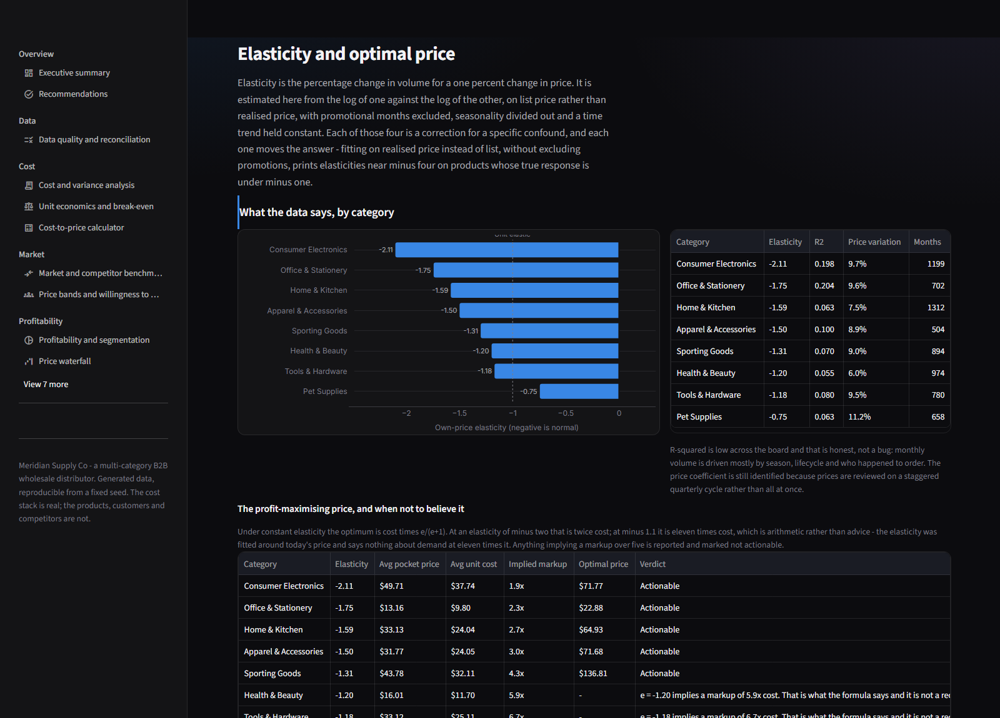

### Competitive position and pass-through

A price index is our price over the market's, times 100. The two ways it lies
are both about what "the market" means: an unweighted mean gives a discount
brand with 2% share the same vote as the category leader, and a shelf price
scraped in March is not evidence about June. So observations are weighted by
freshness with a 45-day half-life, the default central tendency is the median,
and the index reports the age of the data it used.

Pass-through is measured **twice**: against list price it is a decision — how
much of an input move the last review passed on — and against realised pocket
price it is an outcome. The gap between them is the share of an announced
increase that discounting handed straight back.

It is estimated on **quarterly** changes, because that is how often prices are
reviewed. Differencing monthly between two reviews measures customer mix: the
monthly fit explained 7% of the variation and the quarterly fit 59%, and the
monthly coefficient for the one index whose price barely tracks it came out at
−2.15 — a number that says the seller cut price into a rising market, and means
only that there was nothing to fit.

### Unit economics, scenarios and forecasting

Contribution, cost to serve, markup against margin, and break-even in both units
and revenue, with a volume grid of fixed, variable and total cost against
revenue — the chart everyone draws on a whiteboard and almost nobody has to
hand. Operating leverage comes out of the same numbers and is why two products
at the same margin are not the same product.

Scenarios give best, base and worst; a tornado ranking each input by how far
moving it alone moves operating profit; a two-input sensitivity grid; and the
value at which each input drives profit through zero. The three-point case says
out loud that it is every assumption at its own end at once — a stress test, not
an interval.

Forecasting picks per measure by **rolling-origin backtest** rather than by
whichever method fit the history best, scores on WAPE rather than MAPE (MAPE
divides by the actual, so one small month dominates), and takes its interval
from backtest residuals rather than assuming one.

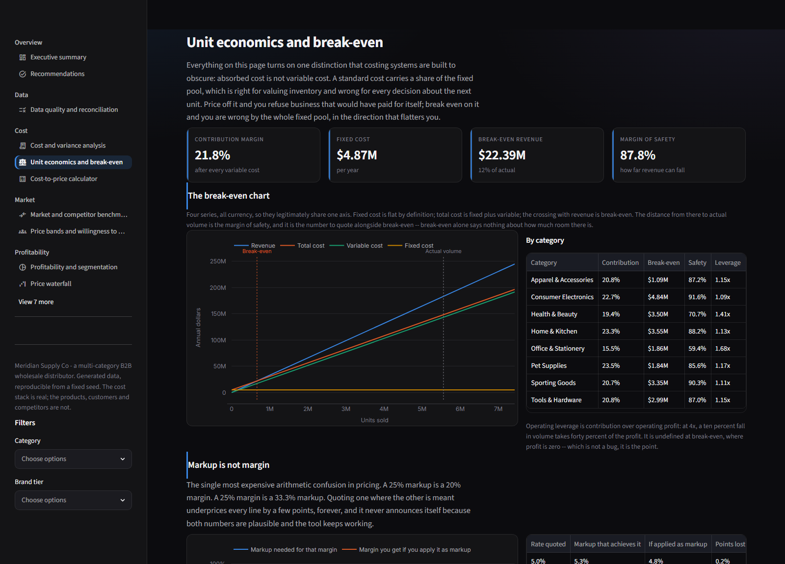

### Guardrails and recommendations

The floor is on **pocket** price, not list — a rule saying "no more than 15% off
list" says nothing about rebates, freight or terms, which is where the margin
actually goes. Approval tiers are on the **gap to target margin**, not on the
discount: two deals at 10% off are not the same deal when one product carries 38
points of margin and the other 19.

The exception scan ranks by margin at risk and colours by *when the money
moves*: red is margin leaving on today's invoices, amber is a price off its
position, green is a leading indicator with nothing lost yet. Ranking by dollars
inside a colour is what makes the list workable; colouring by dollars would put
a large stale listing above a small loss-making one, which is the wrong morning.

The output is not an elasticity — it is a sentence. Six ordered actions across
240 products, worth **$2.65M** of annual gross margin: 130 increases worth
$2.6M, 79 maintains, 16 items that cannot be priced at all until costing
maintains a standard cost for them, 14 bundle candidates and one exit.
"Maintain" is a real answer here, not a fallthrough — an item priced above the
market on demand inelastic enough that coming back would cost more volume than
it buys gets a *defend the premium* rationale.

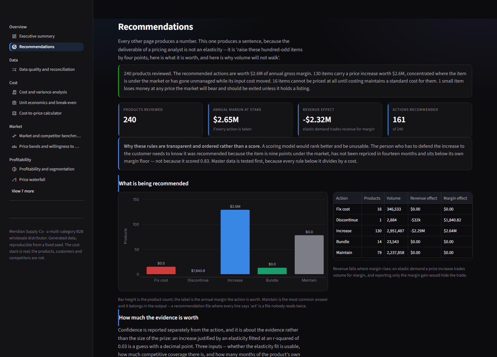

---

## The data

Three complete fiscal years, July 2023 to June 2026. Complete matters: a range
that stops mid-year makes every year-on-year comparison a 277-day period against
a 365-day one, and the resulting "sales are down 24%" is an artefact of the
calendar.

| Table | Rows | What it is |
|---|---:|---|
| `dim_product` | 240 | Catalogue: category, sub-category, brand tier, pack, lifecycle |
| `dim_customer` | 150 | 8 segments, 3 channels, 5 regions, 4 volume tiers |
| `dim_salesperson` | 12 | Region, segment focus, and a discount appetite |
| `dim_competitor` | 5 | Discount, mainstream and premium positions |
| `dim_month` | 36 | Fiscal calendar with a contiguous month index |
| `fact_sales` | 51,311 | Invoice lines with all ten waterfall deductions |
| `fact_cost_element` | 48,270 | Standard against actual for eight cost elements |
| `fact_competitor_price` | 14,091 | Partial, uneven competitive coverage |
| `fact_price_cost_panel` | 8,640 | Monthly cost and price per product |
| `fact_cost_ledger` | 7,044 | Purchases and sellable rates against standard |
| `fact_quote` | 5,600 | Won and lost, with the competing price |
| `fact_price_change` | 2,314 | The price-list change log, with approvals |
| `fact_commodity_index` | 1,422 | Eight weekly input indices |
| `fact_promotion` | 1,022 | Five mechanics, with depth and duration |
| `fact_budget`, `fact_overhead`, `fact_fixed_cost` | 612 | Plan, absorption, fixed pools |

### And the same business as an ERP would hand it over

`raw/` is the SAP SD shape — billing documents and items, sold-to party,
material, base UOM, condition records — with **defects injected on purpose**:
missing standard costs, missing condition records, duplicated lines, negative
quantities, UOM mismatches, value mismatches, orphan customers, implausible
sellable rates, postings dated after the extract, and missing districts.

| Table | Rows |
|---|---:|
| `erp_billing_items` | 17,458 |
| `erp_material_master` | 240 |
| `erp_customer_master` | 150 |
| `erp_condition_records` | 234 |

Every one of the twelve quality rules finds something, which is the point: a
quality page where every check is green has not been tested, it has been fitted.
`engine/stage_erp.py` stages the extract, runs the rules, and reconciles — the
staged total is **$182,476,467.15** against an extract of **$183,875,376.15**,
with all four exclusions named and **$0.00 unexplained**.

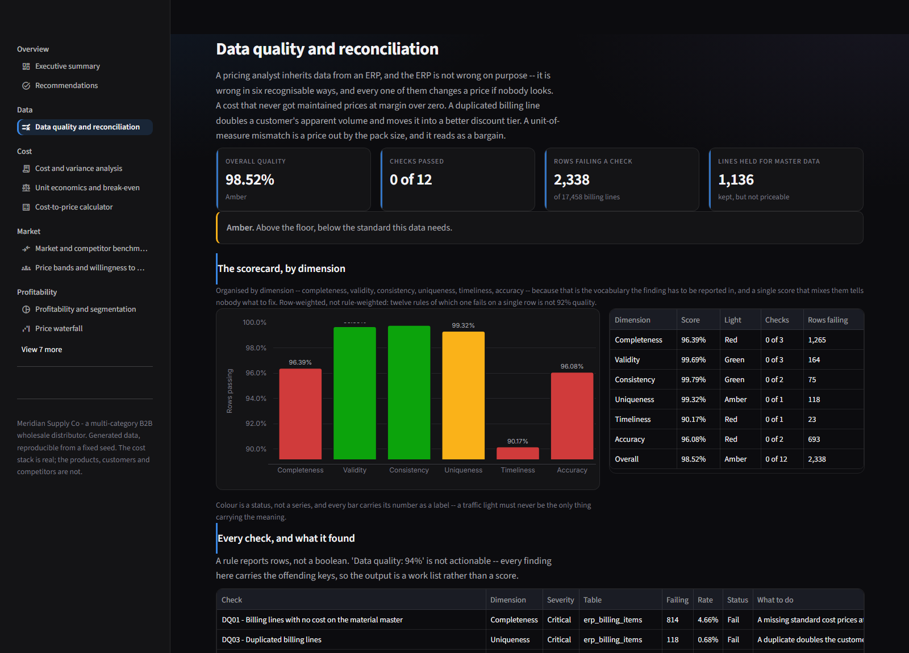

### It is a generative model, not a shuffle of random columns

That is the point: the relationships the analysis claims to find are put in
deliberately, so finding them is a real test of the code.

- Input costs follow a commodity index with its own drift, volatility and
  seasonality. List prices follow it at a **partial pass-through and a lag**, so
  margin compresses between reviews in a rising market and recovers at one.
- Volume responds to price at a **known elasticity per category**.
- Price reviews are **staggered** across the catalogue, with per-review
  idiosyncratic judgement. Without that, price moves only with time, `ln(p)` is
  collinear with the trend, and no elasticity is recoverable at all — the fits
  came back at r² 0.01 and estimates off by a factor of two.
- Standard cost freezes each July while actual cost keeps moving, so **purchase
  price variance builds through the year and resets** at the boundary.
- Discounts are a function of customer tier, channel, terms and the
  salesperson's own appetite, so the **price band for one product is wide and
  explicable** rather than wide and random.
- Customers buy from two or three **core categories**, so the products bought
  together are products that belong together.
- No two SKUs share a sub-category, brand tier and pack format, so a product's
  **description identifies it**. Without that rule, 240 products collapsed to
  137 distinct names — four separate items all called "27in Monitor - Value" —
  which merges rows in any cut keyed on the product and puts two identical
  entries in a dropdown.

`tests/test_generated_data.py` takes those relationships back out through the
real analysis code. Estimated category elasticities preserve the seeded ordering
at a **rank correlation of 0.95** across eight categories (Consumer Electronics
most elastic, Pet Supplies least); the recovered segment price sensitivities
preserve theirs; all eight pass-through estimates are usable, land in the
0.32–0.64 band the indices were seeded across, and every one is attenuated
toward zero — which is what a regression on a noisy realisation of a decision
does.

Everything is reproducible from a fixed seed and reads neither the clock nor the
network. Every table and column is in
[`docs/DATA_DICTIONARY.md`](docs/DATA_DICTIONARY.md), generated from the CSVs and
checked in CI.

**One catalogue, four consumers.** Item code 20017 is the same product in the
cost sheet, in `data/dim_product.csv`, in the ERP extract and in the Power BI
model. That took a defect to get right: the panel used to ride the shared random
stream, downstream of customer generation, so the cost sheet — which rebuilds it
alone — landed on a different draw. Codes matched, descriptions matched, and the
costs were quietly unrelated.

---

## The SQL layer

`sql/pricing_marts.sql` computes six of the marts a second time in DuckDB —
waterfall, profitability with `GROUPING SETS`, a **volume-weighted percentile**
for the price bands, a monthly trend with `LAG` at one and twelve months, margin
concentration with a running share, and the exception list.

DuckDB has no weighted percentile, so the mart builds one: accumulate weight in
price order, then take the lowest price whose running weight has reached the
target. `MIN(...) FILTER (...)` is exact rather than approximate there, because
running weight is monotone in price order.

Two implementations that agree are worth more than one that is merely asserted.
`tests/test_sql_matches_python.py` holds every mart to the pandas version at a
**relative** tolerance of 1e-8 — relative, because the two engines sum the same
numbers in different orders and differ in the last bits of a float, so an
absolute threshold is a number tuned to one dataset that fails on the next
regeneration for a reason nobody can act on.

That gate is what caught the price-band median being **five percent** apart
between the two, under the same column name, with a comment calling the
divergence deliberate.

Every mart also ends on a **total order** — one no two rows can tie on — because
these CSVs are committed and the same query returned a different first row on
Linux than on Windows.

A total order fixes the *rows*. It does not fix the *values*: `SUM(x) OVER ()`
is an unordered aggregate, DuckDB adds the per-thread partial sums back in
whatever order the threads finish, and float addition is not associative. The
same query on the same machine put a share of a grand total at
`0.34695177092808505` one run and `0.346951770928085` the next. Nothing that
reads the column can tell those apart and the 1e-8 gate above is six orders of
magnitude coarser — but the data dictionary samples a real value out of a mart
and CI diffs it, so the last two bits of a number nobody reads decided whether
the build was green. The two places a grand total is a divisor now round at
1e-12, and a test runs the marts twice and compares.

---

## The app

Seventeen pages behind `st.navigation`, grouped the way the work is.

| Group | Page | What it answers |
|---|---|---|
| Overview | Executive summary | Where the business stands, and what moved the margin |
| | Recommendations | Increase, maintain, discount, bundle, fix cost or exit |
| Data | Data quality and reconciliation | Whether any of the rest can be trusted |
| Cost | Cost and variance analysis | Purchase price, yield, labour and overhead against standard |
| | Unit economics and break-even | Contribution, markup against margin, break-even volume |
| | Cost-to-price calculator | The original tool: reprice a book, hand it back as a price list |
| Market | Market and competitor benchmarking | Our price against the market, and cost pass-through |
| | Price bands and willingness to pay | What customers pay for the same thing, and what they'd have paid |
| Profitability | Profitability and segmentation | Profit by product, customer, region, channel, salesperson — eleven cuts |
| | Price waterfall | List to pocket, and which deduction costs the most |
| | Margin bridge | Price, cost, volume, mix, launches and losses — summing exactly |
| Modelling | Pricing simulator | Move six assumptions and watch the operating profit |
| | Elasticity and optimal price | Price response, and the volume a cut has to find |
| | Forecast against actual | Six methods, chosen by backtest, with an empirical interval |
| | Bundles and ladders | Bundle economics judged on incremental margin |
| Execution | Deal guardrails | Floor, target and stretch, and who signs for the gap |
| | Promotions and price-list operations | Which mechanic paid, and what has gone stale |

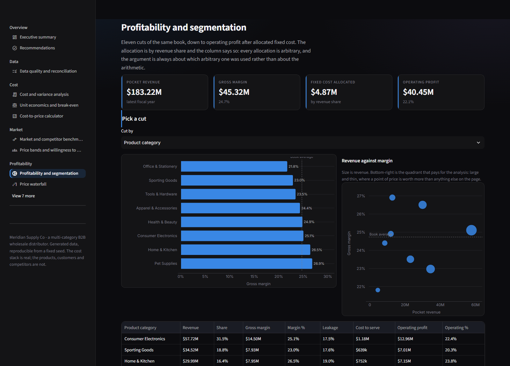

Charts use one fixed categorical palette, assigned by slot and never cycled. The
app is dark, and the palette is the **dark steps** of the same eight hues —
re-stepped for the `#141416` surface and re-validated against it: worst adjacent
colour-vision ΔE 8.4, worst adjacent normal-vision ΔE 19.3, all eight clear 3:1.
Inverting a light palette instead is the failure this guards against; every hue
comes out too dark to separate and nothing reports it, because the chart still
draws.

The theme is set in `.streamlit/config.toml` rather than in CSS, with one
`[theme]` table and no light/dark variants. The variants let the *visitor's*
operating system pick a surface, and only one surface here has a validated
palette on it. It has to be config rather than CSS because `st.dataframe`
renders to a canvas from the theme object in JavaScript — no stylesheet reaches
inside it, and getting that wrong leaves every table a white block in a dark app.

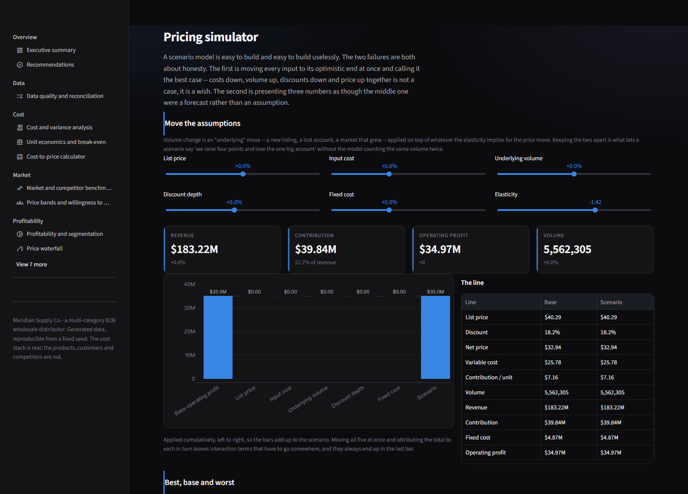

Every view is executed headlessly in CI by `tests/test_app_views_render.py`.
That gate found **eight pages that raised on load** the first time it ran, and
has since caught two more that only show on screen — all listed under
[what is checked](#what-is-checked).

Screenshots here are captured by `docs/capture_screenshots.py`, which drives
Chrome over the DevTools protocol and waits for Streamlit to actually stop
running. `chrome --headless --screenshot` fires when its *virtual* clock runs
out, and virtual time races ahead of real time, so it photographs an empty page
with the spinner still going — for whichever pages happen to be slow that run.

---

## The dashboard

`powerbi/pbip/PricingAnalytics.pbip` — PBIR format, so the report is one JSON
file per visual and the model is TMDL, both reviewable in a diff.

| | |
|---:|---|
| **19** | report pages, **0** visuals that fail to render |
| **189** | visuals |
| **51** | tables, plus a measures table |
| **209** | measures across 21 display folders |
| **22** | relationships, all single-direction many-to-one |
| **4** | what-if parameter tables over `GENERATESERIES` |
| **34** | tables unrelated on purpose, each with the reason in the spec |

See [`powerbi/pbip/OPEN_ME_FIRST.md`](powerbi/pbip/OPEN_ME_FIRST.md) to open it.

### What it looks like

Opened in Power BI Desktop, refreshed against the CSVs, and exported page by
page. All nineteen are in
[`docs/powerbi/screenshots/`](docs/powerbi/screenshots/).

**1 — Executive summary.** Four cards, realised price against cost, leakage by
month, and the margin bridge. `Where the work is` is the same guardrail summary
the Streamlit app opens on, reading the same mart.

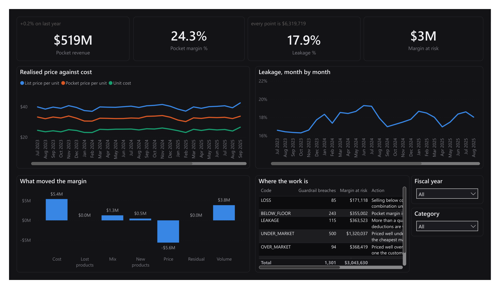

**2 — Price waterfall.** List value down through ten deductions to pocket
revenue, then cost of goods to pocket margin. The step order is the model's,
not the alphabet's, and getting it that way took a sort column, a numeric type
on that column, and a sort definition on the visual — see OPEN_ME_FIRST.

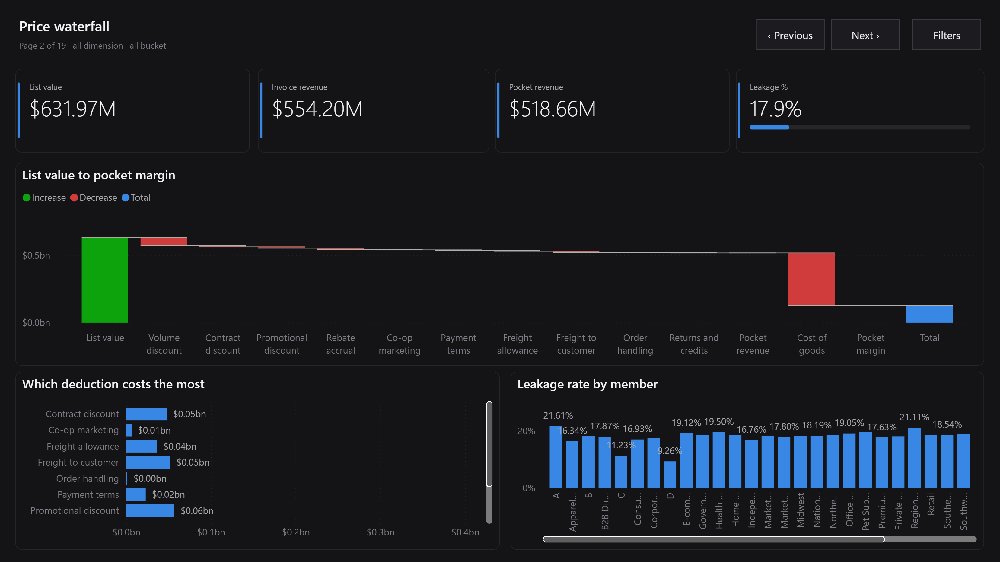

**10 — What-if simulator.** Four `GENERATESERIES` parameters — price, cost,
volume, discount — read back by `SELECTEDVALUE`, driving a three-case
comparison, a tornado of what moves profit most, and the break-even value of
each input on its own.

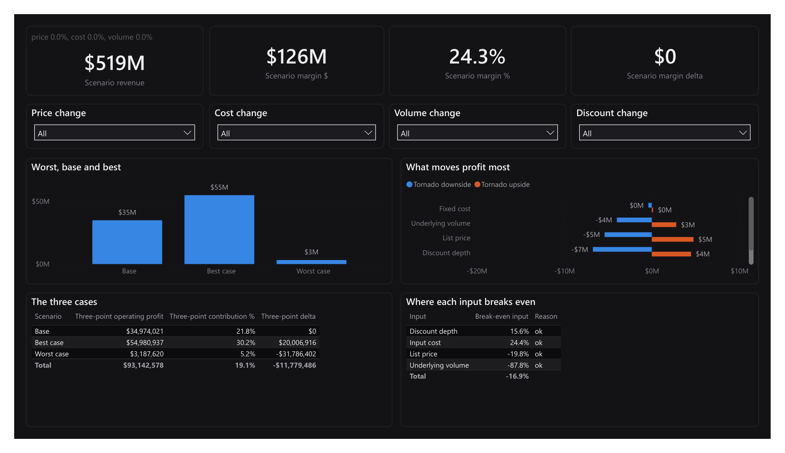

**17 — Exceptions and alerts.** The full exception report under a red / amber /
green split, money at risk by rule, and which segments carry it.

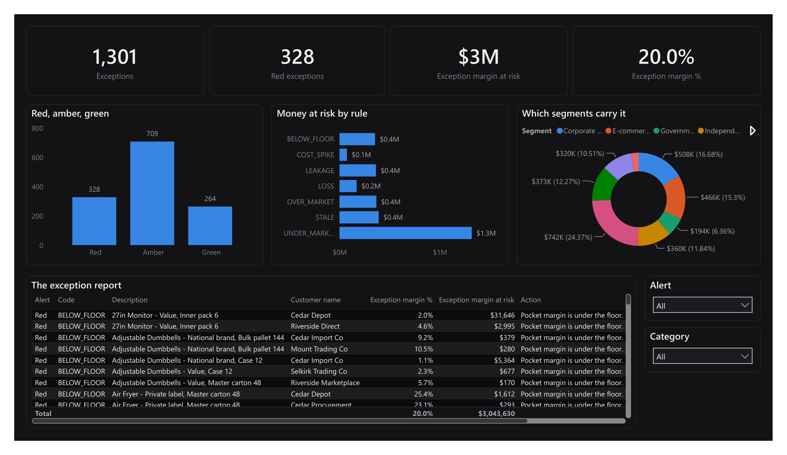

| | | |
|---|---|---|
| [1 Executive summary](docs/powerbi/screenshots/01-summary.png) | [2 Price waterfall](docs/powerbi/screenshots/02-waterfall.png) | [3 Competitive position](docs/powerbi/screenshots/03-competitive.png) |
| [4 Elasticity](docs/powerbi/screenshots/04-elasticity.png) | [5 Cost variance](docs/powerbi/screenshots/05-cost.png) | [6 Margin bridge](docs/powerbi/screenshots/06-bridge.png) |
| [7 Price bands and WTP](docs/powerbi/screenshots/07-bands.png) | [8 Deal guardrails](docs/powerbi/screenshots/08-guardrails.png) | [9 Unit economics](docs/powerbi/screenshots/09-unit-economics.png) |
| [10 What-if simulator](docs/powerbi/screenshots/10-scenario.png) | [11 Forecast vs actual](docs/powerbi/screenshots/11-forecast.png) | [12 Profitability](docs/powerbi/screenshots/12-profitability.png) |
| [13 Discount and promotion](docs/powerbi/screenshots/13-discount.png) | [14 Cost elements](docs/powerbi/screenshots/14-cost-elements.png) | [15 Pricing operations](docs/powerbi/screenshots/15-operations.png) |
| [16 Data quality](docs/powerbi/screenshots/16-quality.png) | [17 Exceptions and alerts](docs/powerbi/screenshots/17-exceptions.png) | [18 Bundles](docs/powerbi/screenshots/18-bundles.png) |
| [19 Recommendations](docs/powerbi/screenshots/19-recommendations.png) | | |

There are also **wireframes** of all nineteen pages in
[`docs/powerbi/`](docs/powerbi/) — every visual's type, position, title and
bound fields, rendered by `powerbi/render_layouts.py` from the same spec
`build_pbip` generates the report from. They are worth more than they sound:
they review in a diff, a screenshot does not, and CI fails if the two drift.

[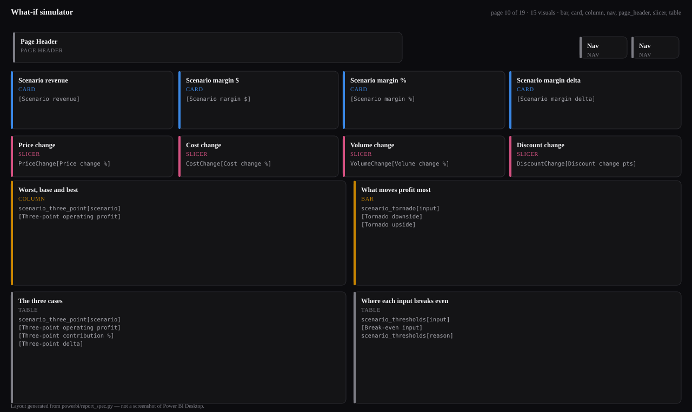](docs/powerbi/)

### It is generated, not typed

From `powerbi/model_spec.py` and `powerbi/report_spec.py`. Typing a hundred and
ninety visual JSON files by hand is how a report ends up carrying three
different `visualContainer` schema versions and a property name Desktop silently
drops on the next save. CI runs `python -m powerbi.build_pbip --check`, which
regenerates into a temp directory and fails on any difference.

Four things in it are worth the name "advanced":

- **What-if parameters** — four calculated tables over `GENERATESERIES`, read
  back by `SELECTEDVALUE`, driving a scenario page. Price and discount share one
  factor, because they move the realised price in opposite directions and
  keeping them apart is how a simulator reports a price rise and a deeper
  discount as if both were good news.
- **Ordering that carries meaning.** A waterfall, a traffic light and a banded
  cross-tab each mean their own order, not the order of their values. Three
  things are needed and only one of them is visible in TMDL: a `sortByColumn`
  on the column, a *numeric* type on that sort key, and a
  `query.sortDefinition` on the visual — because `sortByColumn` orders a
  column's members while the visual goes on sorting by its measure. Getting two
  of the three right leaves a fourteen-step waterfall in dollar order with its
  opening bar in the middle, which is what opening it showed.
- **A real matrix**, with Rows, Columns and Values, for the segment-by-category
  profitability grid and the discount-to-margin cross-tab. A matrix with no
  Columns role is a table with extra chrome.
- **Deliberate disconnection.** Thirty-four tables are unrelated on purpose,
  each with the reason written into the spec beside it. Two more were dropped
  from the model altogether: `executive_summary` and `waterfall_monthly` are
  pre-aggregated, a pre-aggregated row does not respond to a slicer, and one
  sitting beside a card that does is a second number waiting to disagree.

Nothing is computed twice: a measure either aggregates a column the Python
engine already produced or divides two such aggregates. A DAX expression
re-deriving "pocket margin" from list price and seven deduction columns would be
a second implementation of a definition that already has tests, and the two
drift the moment either is edited.

### What the tests check, because Power BI will not

Power BI fails **silently** on a report definition, so the tests check the
things it does not report:

- every measure names only columns that exist, in tables that are in the model;
- every visual binds a field that exists, with `queryRef` and `nativeQueryRef`
  agreeing with the expression they describe;
- every bound column also appears in the M query's type list — a column left out
  arrives as text, still binds, still renders, and sorts alphabetically;
- every numeric formatting literal carries its type suffix (`11D`, not `11`),
  which Desktop otherwise drops on the next save with no error;
- every `VAR` is prefixed `v` + a capital, because Power BI reserves far more
  words for VAR names than the four that are documented and there is no
  published list — a measure that trips one renders "Something's wrong with one
  or more fields" at runtime on a report that built cleanly;
- every parameter table is a `calculated` partition and is related to nothing,
  because a parameter joined to a fact filters that fact to the parameter's own
  value, which is the opposite of what a what-if is for;
- every bound column carries a readable `displayName` — a column arrives in the
  model spelled the way the CSV spelled it, and that is the name a table header
  shows until something overrides it;
- the "one" side of every relationship is unique and the two sides share values;
- nothing falls off the canvas, in either direction — a 76px slicer whose top is
  at y=712 on a 720px page shows eight pixels of itself and reads as a missing
  filter rather than a clipped one. Two of them did;
- every slicer reaches something on its own page, following measure references
  through, because a what-if slicer reaches the page only that way;
- every table in the model is reached by some visual — the check that found four
  dead ones, including a bundles analysis with no page to show it;
- every visual carries alt text that names a field it actually binds;
- every file validates against the published JSON schema it names, and those
  schemas set `additionalProperties: false`, which is what catches a typo.

And the counts in this README are read out of the spec rather than typed —
`tests/test_readme_counts.py` fails if the table above disagrees with the model,
if a page has no screenshot, or if a committed screenshot is never shown. That
table said 191 visuals for a week while the spec said 189.

All of that passed before the project was first opened, and the report was
still wrong in nine ways — a missing manifest that stopped it opening at all, a
field parameter Desktop would not bind, a treemap drawn as an empty box, four
kinds of wrong sort, white slicers on a dark canvas, and source column names on
every table header.
[`OPEN_ME_FIRST.md`](powerbi/pbip/OPEN_ME_FIRST.md) lists all nine with what
each one looked like. Every fix is a change to the generator rather than to its
output, and each has a test that now fails without it — but the honest summary
is that **structural validity is not the same as looking right, and the only
way to find the difference was to open it.**

---

## Metrics

Every number this project publishes, with its definition, is in
**[`docs/METRICS.md`](docs/METRICS.md)** — generated from the model spec and
checked in CI, so a measure renamed in the model is renamed there in the same
commit.

It opens with the **seven conventions**: the decisions that change a number
rather than its presentation, each with two defensible readings, each
implemented one way and pinned by a test.

1. Margin is on **pocket** price, not list or invoice.
2. Discounts are **additive** on list, not compounding.
3. Margin is a fraction of **price**; markup is a fraction of cost.
4. Positive variance is **unfavourable**, for all six.
5. Percentiles are **volume-weighted**.
6. A subtotal bar moves a waterfall by **nothing**.
7. An optimal price that **exists** is not necessarily **actionable**.

Then all 209 measures, grouped as they appear in the Power BI field list, with
their DAX and what each group is for.

---

## Running it

```bash
python -m venv .venv && .venv/Scripts/activate     # Windows
python -m venv .venv && source .venv/bin/activate  # macOS / Linux
pip install -r requirements.txt -r requirements-dev.txt
```

Everything below is deterministic from a fixed seed and rebuilds the committed
files identically:

```bash
python -m seed.generate_market            # data/
python -m seed.generate_erp               # raw/
python -m engine.build_pricing_analytics  # output/
python -m engine.stage_erp                # output/ quality, reconciliation
python -m engine.run_sql                  # output/ the SQL marts
streamlit run app/streamlit_app.py
```

Regenerating the documents and the dashboard:

```bash
python -m docs.build_dictionary     # docs/DATA_DICTIONARY.md
python -m docs.build_metrics        # docs/METRICS.md
python -m powerbi.render_layouts    # docs/powerbi/*.svg
python -m powerbi.build_pbip        # powerbi/pbip/
python -m seed.generate_sheets      # sample_data/*.xlsx
```

Each of those takes `--check`, and CI runs all of them that way.

---

## What is checked

```bash
pytest -q
```

**2,455 tests.** The ones worth reading are the convention tests — additive
versus compounding discounts, margin on pocket versus on list, which side of a
variance is unfavourable, whether a subtotal bar moves a waterfall, whether a
negative amount reads `-$32k` or `$-32k` — because those are where two
defensible readings exist and only one is implemented.

The rest exist because of specific defects. A review pass over the finished
project found ten more, and not one of them raised:

| Where | What |
|---|---|
| Executive summary | Two KPI cards were three-year totals in a row of single-year cards, stamped with the single year |
| Landing page | A point of leakage quoted as a three-year average, two inches under the same sentence for one year |
| SQL | The price-band mart took an unweighted percentile while Python weighted by volume — 5% apart, same column names |
| Profitability | No product and no customer cut, while three surfaces said "profit by product, customer, …" |
| Catalogue | 240 products shared 137 descriptions; four items were all called "27in Monitor - Value" |
| Recommendations | Streamlit reads `$…$` as inline maths, so a paragraph with three amounts lost every dollar sign |
| Recommendations | A generated sentence read "1 small items lose money" |
| Everywhere | Negative amounts read `$-32k`; on a page of variances, that is most of the page |
| Charts | Direct labels ran off the plot, reliably clipping the longest bar |
| Dashboard | Four model tables no visual reached, and a page named "Price bands" that never drew a band |

Earlier gates caught eight Streamlit pages that raised on load, two Power BI
slicers eight pixels tall, two SQL marts with no deterministic row order, a
`DataPath` that made the drift gate pass only on the machine that generated it,
and pinned dependency versions that nothing here had ever run on.

---

## Notes

Originally built for a live ERP. Employer identifiers, vendor names and real
cost data have been removed; the lanes and suppliers are generic, and everything
in `data/`, `raw/`, `output/` and `sample_data/` is generated.
